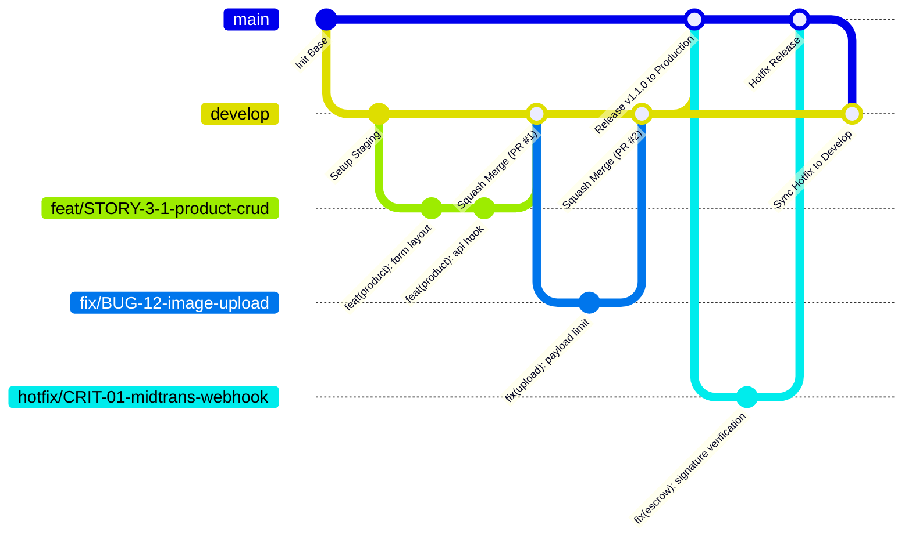

# 🚀 SOP-01: Git Workflow & Branching Strategy
## Bicket Marketplace Engineering Office

---

| Dokumen Kontrol | Keterangan |
| :--- | :--- |
| **ID SOP** | `SOP-DEV-001` |
| **Versi** | `v1.0` |
| **Status** | **Approved & Active** |
| **Level Prioritas** | 🔴 **Must-Have (Wajib)** |
| **Otoritas / Pemilik** | Chief Technology Officer (CTO) |
| **Target Audience** | Seluruh Developer (Frontend, Backend, Fullstack, DevOps) |
| **Tanggal Efektif** | 31 Agustus 2026 |

---

## 1. 🎯 Tujuan (Purpose)

1. **Standardisasi Alur Kerja**: Menjamin setiap perubahan kode (*codebase*) memiliki alur yang jelas, terkontrol, dan dapat ditelusuri (*traceable*).
2. **Isolasi Lingkungan (Environment Stability)**: Memisahkan secara tegas antara lingkungan pengembangan aktif (*development*), *staging/preview* (pengujian performa & integrasi), dan lingkungan produksi (*live production*).
3. **Mencegah Tabrakan Kode (*Merge Hell*)**: Memastikan integrasi cabang fitur berjalan teratur menggunakan metode *Squash & Merge*.
4. **Audit Trail Transparan**: Menghubungkan setiap *commit* dan *Pull Request* dengan Story / Task RPK yang sah.

---

## 2. 🌲 Model & Hirarki Branching (Branching Topology)

Bicket mengadopsi struktur **4-Tier Branching Strategy**:



---

### 2.1 Definisi & Tanggung Jawab Cabang (Branch Roles)

| Nama Branch | Sumber Turunan (*Branch From*) | Target Merge (*Merge To*) | Lingkungan Deploy (*Environment*) | Aturan Proteksi (*Rules*) |
| :--- | :--- | :--- | :--- | :--- |
| **`main`** | - | - | **Production (Live)** | 🔒 **Locked**: Wajib PR dari `develop` atau `hotfix/*`, min. 1 Approval CTO/Lead, lolos seluruh CI test. Larangan direct commit. |
| **`develop`** | `main` | `main` | **Staging / Preview** | 🛡️ **Protected**: Target integrasi harian. Otomatis deploy ke Staging untuk pengujian fitur & performa. |
| **`feat/*`** | `develop` | `develop` | Local Dev / Preview URL | Jangka pendek (*short-lived*, 1–3 hari). Menggunakan Squash & Merge ke `develop`. |
| **`fix/*`** | `develop` | `develop` | Local Dev / Preview URL | Perbaikan bug non-kritis selama sprint berjalan. |
| **`hotfix/*`** | `main` | `main` & `develop` | Staging ➔ Production | Perbaikan darurat kendala kritis di Production (P0 Blocker / Transaksi). |

---

## 3. 🏷️ Konvensi Penamaan Branch (Naming Conventions)

Setiap developer **WAJIB** menamai branch dengan format baku:

```
<tipe>/<TASK-ID>-<deskripsi-singkat-kebab-case>
```

### Format & Contoh Valid:
- **Fitur Baru**:
  - `feat/STORY-3-1-manage-product-form`
  - `feat/STORY-4-2-escrow-payout-request`
  - `feat/DS-10-skeuo-card-component`
- **Bug Fix Reguler**:
  - `fix/BUG-05-date-picker-mobile-overflow`
  - `fix/BUG-14-cart-quantity-recalc`
- **Hotfix Darurat**:
  - `hotfix/PAY-99-midtrans-signature-null-check`
  - `hotfix/AUTH-01-supabase-token-expired`

> ❌ **DILARANG**: `fitur-baru`, `fix-error`, `naufal-branch`, `test123`, `update-design`.

---

## 4. 📝 Standar Pesan Commit (Conventional Commits)

Commit di Bicket mengikuti standar **Conventional Commits** dengan referensi ID Task:

### Struktur Pesan Commit:
```
<tipe>(<scope>): [<TASK-ID>] <deskripsi singkat imperative>

[Opsional: Penjelasan detail perubahan atau alasan teknis]
```

### Daftar Tipe Commit:
- **`feat`** : Penambahan fitur baru yang berdampak pada user / API.
- **`fix`** : Perbaikan bug pada logic atau antarmuka.
- **`refactor`** : Restrukturisasi kode tanpa mengubah fungsionalitas (misal: memecah komponen besar).
- **`style`** : Perubahan styling visual, Tailwind class, tanpa logic change.
- **`perf`** : Optimasi performa (misal: lazy loading gambar, indexing query Prisma).
- **`test`** : Penambahan atau perbaikan unit test (Vitest).
- **`docs`** : Perubahan dokumentasi, SOP, atau result docs.
- **`chore`** : Pembaruan dependency, konfigurasi build/eslint/tsconfig.

### Contoh Pesan Commit yang Benar:
```bash
feat(product): [STORY-3-1] create product form with image upload gallery
fix(payout): [BUG-08] prevent duplicate payout request on double click
perf(catalog): [PERF-02] optimize product query with prisma select fields
docs(sop): [SOP-01] update git workflow branch topology
```

---

## 5. 🔄 Alur Siklus Kerja Developer (Daily Step-by-Step Flow)

```
 [1. Pull develop] ➔ [2. Buat feat/*] ➔ [3. Koding & Commit] ➔ [4. Verifikasi Lokal (tsc/lint)]
                                                                               │
 [8. Review Performa & Integrasi] ◄─ [7. Auto-Deploy Staging] ◄─ [6. PR & Review] ◄────┘
```

### Langkah 1: Sinkronisasi Awal dari `develop`
```bash
# Pastikan berada di branch develop terbaru
git checkout develop
git pull origin develop

# Buat branch fitur baru
git checkout -b feat/STORY-3-1-product-crud
```

### Langkah 2: Pengerjaan & Commit Teratur
```bash
# Lakukan commit bertahap dengan pesan yang jelas
git add .
git commit -m "feat(product): [STORY-3-1] implement product variant selector"
```

### Langkah 3: Verifikasi Kualitas Lokal (Wajib Sebelum Push)
Sebelum mendorong kode ke remote repository, developer **wajib** menjalankan health check di lokal:
```bash
# 1. Type check TypeScript tanpa emit
npx tsc --noEmit

# 2. Linting check
npm run lint

# 3. Verifikasi build lokal (Opsional jika ada perubahan besar)
npm run build
```

### Langkah 4: Push Branch & Buka Pull Request (PR) ke `develop`
```bash
git push -u origin feat/STORY-3-1-product-crud
```
- Buka Pull Request di GitHub / GitLab dengan target: **`base: develop` ◄ `compare: feat/...`**.
- Isi template PR:
  - **Deskripsi Fitur**: Penjelasan apa yang dibuat.
  - **Task Reference**: Link/ID Story RPK terkait.
  - **Checklist Verifikasi**: Screenshot UI / Respons API.

---

## 6. 🚦 Staging Deployment & Quality Gate (Review Performa & QA)

Sesuai arahan arsitektur Bicket, branch **`develop`** terhubung dengan lingkungan **Staging Auto-Deploy**.

### Tahapan Setelah PR Di-Merge ke `develop`:
1. **Otomatisasi Deployment**:
   - Sistem CI/CD secara otomatis mem-build dan men-deploy branch `develop` ke environment Staging (`https://staging.bicket.id` atau preview URL).
2. **Review Aspek Performa & UX (Performance Check)**:
   - **Lighthouse / Core Web Vitals**: Periksa nilai FCP (*First Contentful Paint*) dan LCP (*Largest Contentful Paint*).
   - **Bundle Size**: Pastikan tidak ada library berat yang tidak sengaja di-import pada client component.
   - **Responsive & Mobile View**: Uji coba pada resolusi mobile (Android/iOS) sesuai target pasar rental baju.
   - **Data Fetching Speed**: Pastikan endpoint API merespon dalam batas wajar (< 300ms untuk query produk).
3. **Pengujian Manual oleh QA (SOP-06 QA Manual Test Checklist)**:
   - QA menguji fitur di Staging mengacu pada file `features/[fitur]/docs/task/story-[id]/manual-test.md` yang disiapkan developer pembuat fitur.
   - QA mencentang skenario **Must-Have** (Fungsi Inti & Validasi) dan **Should-Have** (Mobile & UX State).
   - QA menandatangani dokumen (*QA Sign-Off*) jika seluruh skenario lolos.
4. **Penyelesaian Bug Integrasi**:
   - Jika ditemukan kendala performa atau logic pada Staging, perbaikan dilakukan melalui branch `fix/*` ke `develop`.

---

## 7. 🚢 Rilis ke Production (`develop` ➔ `main`)

1. Rilis ke `main` dilakukan secara berkala (misal: di akhir siklus sprint atau saat satu milestone fitur selesai teruji di Staging).
2. Dibuat Pull Request dari **`develop`** ke **`main`**.
3. **Checklist Rilis Produksi (Production Readiness)**:
   - ✅ Dokumen `manual-test.md` seluruh fitur telah berstatus **PASSED** (QA Sign-Off disetujui).
   - ✅ Seluruh fitur pada `develop` telah teruji di Staging tanpa bug kritis (*zero blocker*).
   - ✅ Prisma migration terverifikasi aman (`npx prisma migrate status`).
   - ✅ Variabel environment (`.env`) produksi telah disiapkan.
   - ✅ Disetujui oleh CTO / Engineering Lead.
4. Setelah merge ke `main`, buat Git Tag versi:
   ```bash
   git checkout main
   git pull origin main
   git tag -a v1.1.0 -m "Release Milestone V1.1.0: Product & Escrow Engine"
   git push origin v1.1.0
   ```

---

## 8. 🚨 Alur Penanganan Insiden Darurat (Hotfix Flow)

Jika terjadi *Critical Blocker* di Production (misal: Webhook pembayaran gagal, server crash, celah keamanan):

1. Buat branch langsung dari `main`:
   ```bash
   git checkout main
   git pull origin main
   git checkout -b hotfix/CRIT-01-midtrans-webhook-signature
   ```
2. Kerjakan perbaikan minimal yang tepat sasaran (*targeted fix*).
3. Uji lokal secara ketat, lalu ajukan PR darurat ke `main`.
4. Setelah di-merge ke `main`, **WAJIB sinkronisasi ulang ke `develop`** agar perbaikan tidak tertimpa:
   ```bash
   git checkout develop
   git pull origin develop
   git merge main
   git push origin develop
   ```

---

## 9. ⛔ Larangan Keras (*Strict Prohibitions*)

1. ❌ **Dilarang Force Push (`git push --force`)** pada branch `main` dan `develop`.
2. ❌ **Dilarang Direct Commit / Direct Push** ke branch `main` atau `develop`.
3. ❌ **Dilarang Mengabaikan TypeScript Error** (Dilarang keras memakai `// @ts-ignore` atau type `any` tanpa justifikasi tertulis).
4. ❌ **Dilarang Menyertakan Credential / Secret Key** (`.env.local`, file private key, service role key) ke dalam Git tracking.

---

*Dokumen ini merupakan standar resmi Engineering Office Bicket. Setiap anggota tim rekayasa perangkat lunak wajib membaca, memahami, dan mematuhi SOP ini.*
