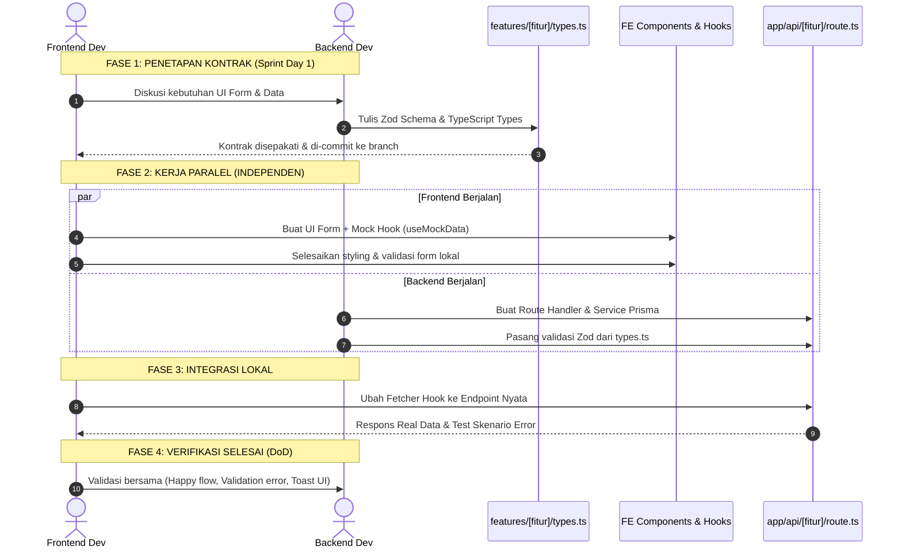

# 🔌 SOP-02: Kontrak API & Kolaborasi Frontend–Backend
## Bicket Marketplace Engineering Office

---

| Dokumen Kontrol | Keterangan |
| :--- | :--- |
| **ID SOP** | `SOP-DEV-002` |
| **Versi** | `v1.0` |
| **Status** | **Approved & Active** |
| **Level Prioritas** | 🔴 **Must-Have (Wajib)** |
| **Otoritas / Pemilik** | Chief Technology Officer (CTO) |
| **Target Audience** | Frontend Developer (FE), Backend Developer (BE), QA/Tester |
| **Tanggal Efektif** | 31 Agustus 2026 |

---

## 1. 🎯 Tujuan (Purpose)

1. **Eliminasi Hambatan Kerja (*Zero-Blocker Culture*)**: Memastikan Frontend Developer dapat langsung membangun UI dan logic tanpa harus menunggu Backend selesai membuat endpoint, melalui pendekatan *Contract-First & Mocking*.
2. **Jaminan Keselamatan Tipe (*End-to-End Type Safety*)**: Menggunakan TypeScript dan Zod Schema sebagai *Single Source of Truth* bersama antara antarmuka pengguna dan server API Next.js.
3. **Mencegah Kerusakan Antarmuka (*Anti-Breaking UI*)**: Menstandarisasi struktur respons JSON sehingga Frontend tidak pernah mengalami *crash (blank screen)* akibat perubahan skema data sepihak.
4. **Pemisahan Tanggung Jawab (*Clear Separation of Concerns*)**: Menegakkan batasan area kerja 3-Tier Modular Monolith sesuai [architecture.md](file:///d:/2-Project/bicket/.agents/rules/architecture.md).

---

## 2. 🏛️ Arsitektur 3-Tier & Wilayah Tanggung Jawab

```
┌─────────────────────────────────────────────────────────────────────────────┐
│ 1. PRESENTATION LAYER (Tanggung Jawab FE)                                   │
│    - File: features/[fitur]/components/*.tsx                                │
│    - File: app/(pages)/*.tsx                                                │
│    - UI Rendering, React Hook Form, State Lokal, Toast/Error Banner         │
├─────────────────────────────────────────────────────────────────────────────┤
│ 2. LOGIC LAYER (Kolaborasi FE & BE - "Jembatan Kontrak")                     │
│    - File: features/[fitur]/types.ts  <-- KONTRAK UTAMA (ZOD + TS TYPES)    │
│    - File: features/[fitur]/hooks/*.ts (FE: Custom Hooks & TanStack Query)  │
│    - File: features/[fitur]/api.ts     (FE/BE: Client API Fetcher)          │
├─────────────────────────────────────────────────────────────────────────────┤
│ 3. DATA & BACKEND LAYER (Tanggung Jawab BE)                                 │
│    - File: app/api/[fitur]/route.ts   (Next.js Route Handlers & Validasi)   │
│    - File: features/[fitur]/services/*.ts (Prisma ORM CRUD & Logic Bisnis) │
│    - File: prisma/schema.prisma       (Database Entities & Migrations)      │
└─────────────────────────────────────────────────────────────────────────────┘
```

---

## 3. 📦 Standar Struktur Response API (JSON Envelope)

Seluruh endpoint API Bicket (`/api/*`) **WAJIB** membungkus respons dalam format *Envelope JSON* standar berikut:

### 3.1 Respons Sukses Data Tunggal / Mutasi (HTTP 200 / 201)
```typescript
interface ApiResponseSuccess<T> {
  success: true;
  data: T;
  message?: string;
}
```
**Contoh Output (HTTP 200):**
```json
{
  "success": true,
  "data": {
    "id": "prod_cm71829abc",
    "name": "Baju Bodo Modern Sutera",
    "price": 150000,
    "rentalType": "READY",
    "stock": 3
  },
  "message": "Produk berhasil diperbarui"
}
```

---

### 3.2 Respons Sukses Data Koleksi / Paginasi (HTTP 200)
Query parameter standar: `?page=1&limit=10&search=&sort=newest`

```typescript
interface PaginationMeta {
  page: number;
  limit: number;
  total: number;
  totalPages: number;
}

interface ApiPaginatedResponse<T> {
  success: true;
  data: T[];
  meta: PaginationMeta;
}
```
**Contoh Output (HTTP 200):**
```json
{
  "success": true,
  "data": [
    { "id": "prod_1", "name": "Gaun Pesta Glamour", "price": 250000 },
    { "id": "prod_2", "name": "Kebaya Wisuda Maroon", "price": 175000 }
  ],
  "meta": {
    "page": 1,
    "limit": 10,
    "total": 45,
    "totalPages": 5
  }
}
```

---

### 3.3 Respons Gagal / Error (HTTP 4xx / 5xx)
Format error terstandarisasi untuk memudahkan FE menampilkan pesan ramah pengguna (*user-friendly toast/alert*):

```typescript
interface ApiErrorDetail {
  field?: string;
  message: string;
}

interface ApiResponseError {
  success: false;
  error: {
    code: string;           // Kode error mesin (SNAKE_CASE_UPPER)
    message: string;        // Pesan ringkas untuk user
    details?: ApiErrorDetail[]; // Detail validasi Zod (opsional)
  };
}
```
**Contoh Output Error Validasi Form (HTTP 422 Unprocessable Entity):**
```json
{
  "success": false,
  "error": {
    "code": "VALIDATION_ERROR",
    "message": "Input form tidak valid. Silakan periksa kolom yang ditandai.",
    "details": [
      { "field": "price", "message": "Harga sewa minimal Rp 10.000" },
      { "field": "images", "message": "Wajib mengunggah minimal 1 foto produk" }
    ]
  }
}
```

---

## 4. 🏷️ Katalog Kode Error Standar (Business Error Codes)

| HTTP Status | Error Code | Skenario Penggunaan |
| :--- | :--- | :--- |
| **`400`** | `BAD_REQUEST` | Payload request rusak atau query parameter tidak dikenali. |
| **`401`** | `AUTH_UNAUTHORIZED` | User belum login atau sesi token Supabase kedaluwarsa. |
| **`403`** | `AUTH_FORBIDDEN` | User login tetapi tidak memiliki hak akses (misal: Buyer akses halaman Creator). |
| **`403`** | `CREATOR_NOT_VERIFIED` | Akun kreator belum diverifikasi admin untuk menambah produk. |
| **`404`** | `RESOURCE_NOT_FOUND` | Data produk, pesanan, atau kreator tidak ditemukan di database. |
| **`409`** | `CONFLICT_STATE` | Konflik status bisnis (misal: membatalkan pesanan yang sudah `SHIPPED`). |
| **`422`** | `VALIDATION_ERROR` | Gagal validasi Zod schema pada request body. |
| **`422`** | `STOCK_INSUFFICIENT` | Stok variasi baju tidak mencukupi untuk disewa pada tanggal tersebut. |
| **`422`** | `ESCROW_LOCKED` | Penarikan dana gagal karena saldo masih berstatus *Held* (belum rilis). |
| **`500`** | `INTERNAL_SERVER_ERROR` | Kesalahan tidak terduga pada server/database (Crash). |
| **`502`** | `PAYMENT_GATEWAY_ERROR`| Gagal berkomunikasi dengan Midtrans API. |

---

## 5. 🔄 Alur Kolaborasi Kontrak Kerja (4-Phase Contract-First Flow)



---

### Langkah Praktis Implementasi Monolith di `types.ts`

Setiap fitur wajib memiliki satu file `features/[fitur]/types.ts` yang mendefinisikan Zod Schema dan TypeScript Types sekaligus:

```typescript
// features/manage-product/types.ts
import { z } from "zod";

// 1. Zod Schema untuk Validasi Input (Dipakai di React Hook Form & Next.js API Route)
export const createProductSchema = z.object({
  name: z.string().min(3, "Nama produk minimal 3 karakter"),
  description: z.string().min(10, "Deskripsi minimal 10 karakter"),
  price: z.number().positive("Harga sewa harus lebih dari 0"),
  rentalType: z.enum(["READY", "PREORDER"]),
  stock: z.number().int().nonnegative("Stok tidak boleh negatif"),
  category: z.string().min(1, "Kategori wajib dipilih"),
  images: z.array(z.string().url("URL gambar tidak valid")).min(1, "Minimal 1 foto produk"),
});

// 2. Tipe Data Inferensi Otomatis dari Zod
export type CreateProductInput = z.infer<typeof createProductSchema>;

// 3. Tipe Data Respons Entitas Produk Lengkap
export interface ProductItem {
  id: string;
  name: string;
  description: string;
  price: number;
  rentalType: "READY" | "PREORDER";
  stock: number;
  category: string;
  images: string[];
  creatorId: string;
  createdAt: string;
  updatedAt: string;
}
```

---

## 6. 🛡️ Aturan Keamanan & Integritas Data (Data Integrity Rules)

1. **Never Trust Client Data**: Backend **WAJIB** memvalidasi ulang seluruh request body menggunakan `schema.safeParse(body)` sebelum menyentuh query Prisma.
2. **No Business Logic on Client**: Frontend tidak boleh menghitung sendiri total biaya escrow atau potongan fee platform; seluruh perhitungan finansial dilakukan di Backend.
3. **No Sensitive Leaks**: Backend dilarang mengembalikan field sensitif (seperti `passwordHash`, `supabaseSecretKey`, atau `midtransServerKey`) dalam respons API publik.
4. **Idempotent Mutation**: Endpoint mutasi kritis (seperti pembuatan order sewa dan pengajuan payout) wajib menangani *idempotency* untuk mencegah *double charge / double request*.

---

## 7. ⛔ Larangan Keras (*Strict Prohibitions*)

1. ❌ **Dilarang mengubah struktur field JSON response** tanpa koordinasi dan pembaruan `types.ts` terlebih dahulu.
2. ❌ **Dilarang melempar respon `200 OK` jika operasi gagal** (Hindari anti-pattern `{ status: 200, success: false }`). Gunakan HTTP Status Code yang semantik (`400`, `422`, `500`).
3. ❌ **Dilarang membiarkan FE menunggu BE selesai** untuk mulai membuat tampilan antarmuka (Gunakan Mock Data).
4. ❌ **Dilarang menuliskan duplikasi Zod schema** secara terpisah di Frontend dan Backend (Wajib ambil dari `features/[fitur]/types.ts`).

---

*Dokumen ini merupakan standar resmi interaksi antarmuka dan rekayasa backend di Bicket Marketplace.*
