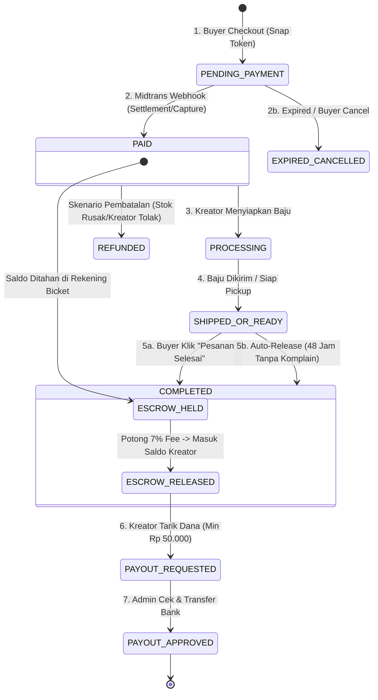

# 💳 SOP-03: Integritas Transaksi, Sistem Escrow (Rekber), & Webhook Midtrans
## Bicket Marketplace Engineering Office

---

| Dokumen Kontrol | Keterangan |
| :--- | :--- |
| **ID SOP** | `SOP-DEV-003` |
| **Versi** | `v1.0` |
| **Status** | **Approved & Active** |
| **Level Prioritas** | 🔴 **Must-Have (Wajib & Kritis)** |
| **Otoritas / Pemilik** | Chief Technology Officer (CTO) |
| **Target Audience** | Backend Developer, Database Engineer, Finance/Operations Admin |
| **Tanggal Efektif** | 31 Agustus 2026 |

---

## 1. 🎯 Tujuan (Purpose)

1. **Jaminan 0% Kesalahan Finansial (*Zero Financial Deficit*)**: Memastikan seluruh pergerakan uang (pembayaran, penahanan saldo rekber, pemotongan fee, dan pencairan) terhitung secara akurat dan tidak ada saldo yang menguap atau berlipat ganda.
2. **Operasi Database Atomik (*Atomic State Integrity*)**: Menghindari *race condition* atau inkonsistensi data dengan mewajibkan seluruh mutasi saldo berjalan dalam `prisma.$transaction`.
3. **Penanganan Webhook Aman & Idempoten (*Idempotent Webhook Processing*)**: Menjamin pemrosesan notifikasi Midtrans yang datang berulang kali tidak memicu mutasi ganda.
4. **Struktur Fee Transparan**: Menstandarisasi perhitungan *Buyer Service Fee (5%)* dan *Creator Platform Fee (7%)*.

---

## 2. 💰 Struktur Finansial & Model Biaya (Fee Structure)

Bicket menerapkan model monetisasi dua sisi (*two-sided platform fee*):

```
┌─────────────────────────────────────────────────────────────────────────────┐
│ 1. SISI BUYER (Saat Checkout):                                              │
│    Subtotal Sewa Produk + Biaya Pengiriman (jika ada)                       │
│    + Buyer Platform Service Fee: 5% x Subtotal Sewa                         │
│    = TOTAL TAGIHAN MIDTRANS SNAP                                            │
├─────────────────────────────────────────────────────────────────────────────┤
│ 2. SISI ESCROW (Saat Webhook Settlement):                                   │
│    Total Dana Masuk Ditahan di Rekening Penampung Bicket (Escrow Held)      │
├─────────────────────────────────────────────────────────────────────────────┤
│ 3. SISI KREATOR (Saat Escrow Release / Order Selesai):                      │
│    Subtotal Sewa Produk                                                     │
│    - Creator Commission Fee: 7% x Subtotal Sewa                             │
│    = SALDO BERSIH KREATOR (Masuk ke Available Balance)                      │
│                                                                             │
│    *Catatan: Ongkos kirim (Delivery Fee) 100% diteruskan tanpa potongan 7%  │
└─────────────────────────────────────────────────────────────────────────────┘
```

---

## 3. 🔄 Siklus Hidup Transaksi & Rekber (Escrow State Machine)



---

## 4. 🛡️ SOP Penanganan Webhook Midtrans (Idempotency & Signature)

Endpoint Webhook: `POST /api/webhooks/midtrans`

### 4.1 Protokol Validasi Signature SHA512 (Wajib Sebelum Baca Data)
Setiap notifikasi webhook yang masuk **WAJIB** diverifikasi integritasnya menggunakan SHA512 hash:
```
Signature Hash = SHA512(order_id + status_code + gross_amount + ServerKey)
```

Jika signature tidak cocok, server **WAJIB langsung mengembalikan `HTTP 403 Forbidden`** dan menghentikan proses untuk mencegah manipulasi data dari pihak luar.

---

### 4.2 Protokol Idempotensi (Mencegah Mutasi Ganda)
Midtrans dapat mengirimkan webhook yang sama beberapa kali (*retry policy*). Developer wajib menerapkan pengecekan idempotensi:

```typescript
// app/api/webhooks/midtrans/route.ts
export async function POST(req: Request) {
  const body = await req.json();
  const { order_id, transaction_status, fraud_status, signature_key, status_code, gross_amount } = body;

  // 1. Verifikasi Signature SHA512
  const expectedSignature = crypto
    .createHash("sha512")
    .update(`${order_id}${status_code}${gross_amount}${process.env.MIDTRANS_SERVER_KEY}`)
    .digest("hex");

  if (signature_key !== expectedSignature) {
    return NextResponse.json({ success: false, error: "INVALID_SIGNATURE" }, { status: 403 });
  }

  // 2. Transaksi Database Atomik
  await prisma.$transaction(async (tx) => {
    const order = await tx.order.findUnique({
      where: { id: order_id },
      include: { escrow: true },
    });

    if (!order) throw new Error("ORDER_NOT_FOUND");

    // Idempotency Check: Jika order sudah PAID, lewati mutasi untuk cegah double credit
    if (order.status === "PAID" && (transaction_status === "settlement" || transaction_status === "capture")) {
      return; // Early return, respons 200 OK
    }

    if (transaction_status === "settlement" || (transaction_status === "capture" && fraud_status === "accept")) {
      // Update Status Order
      await tx.order.update({
        where: { id: order_id },
        data: { status: "PAID", paidAt: new Date() },
      });

      // Catat Saldo Rekber (Escrow Held)
      await tx.escrowBalance.create({
        data: {
          orderId: order.id,
          creatorId: order.creatorId,
          grossAmount: order.totalAmount,
          heldAmount: order.subtotalAmount, // Nilai yang akan diteruskan ke kreator
          status: "HELD",
        },
      });
    } else if (["expire", "cancel", "deny"].includes(transaction_status)) {
      await tx.order.update({
        where: { id: order_id },
        data: { status: "CANCELLED" },
      });
    }
  });

  return NextResponse.json({ success: true, message: "Webhook processed" });
}
```

---

## 5. 🔓 SOP Pelepasan Dana Rekber (Escrow Release & Komisi 7%)

Pelepasan dana dari status `HELD` ke `RELEASED` hanya boleh terjadi jika pesanan berstatus **`COMPLETED`**.

### 5.1 Trigger Pelepasan Dana:
1. **Manual Buyer Confirmation**: Pembeli menekan tombol *"Konfirmasi Pesanan Selesai / Terima Baju"*.
2. **Auto-Complete (48 Jam)**: Jika status pesanan sudah `SHIPPED` atau `READY_FOR_PICKUP` dan pembeli tidak mengajukan komplain dalam waktu **2 x 24 jam**, sistem cron job otomatis menandai pesanan `COMPLETED` dan melepas saldo.

### 5.2 Logika Perhitungan Pelepasan Dana Atomik:
```typescript
// Skenario: Subtotal Sewa = Rp 200.000
const subtotal = order.subtotalAmount; // 200000
const platformCommission = subtotal * 0.07; // 7% = 14000
const netCreatorEarning = subtotal - platformCommission; // 93% = 186000

await prisma.$transaction(async (tx) => {
  // 1. Update Escrow status
  await tx.escrowBalance.update({
    where: { orderId: order.id },
    data: {
      status: "RELEASED",
      releasedAt: new Date(),
      platformFeeAmount: platformCommission,
      netAmount: netCreatorEarning,
    },
  });

  // 2. Tambahkan ke Available Balance Kreator
  await tx.creatorWallet.update({
    where: { creatorId: order.creatorId },
    data: {
      availableBalance: { increment: netCreatorEarning },
      totalEarned: { increment: netCreatorEarning },
    },
  });

  // 3. Catat Riwayat Mutasi Saldo
  await tx.walletMutation.create({
    data: {
      creatorId: order.creatorId,
      orderId: order.id,
      type: "ESCROW_CREDIT",
      amount: netCreatorEarning,
      description: `Pencairan sewa order #${order.id} (Potongan komisi 7% Rp ${platformCommission.toLocaleString("id-ID")})`,
    },
  });
});
```

---

## 6. 🏧 SOP Penarikan Dana Kreator (Payout System)

### 6.1 Aturan Penarikan (Payout Business Rules)
1. **Batas Minimal Penarikan**: **Rp 50.000**.
2. **Validasi Rekening Bank**: Nama pemilik rekening bank **wajib sesuai** dengan nama terdaftar profil kreator.
3. **Mekanisme Eksekusi (Fase MVP)**:
   - Kreator mengajukan permintaan (*Payout Request*). Saldo yang ditarik langsung dikunci (*deducted from available balance, placed in pending payout*).
   - Tim Finance / Admin memeriksa pengajuan di Dashboard Admin.
   - Admin melakukan transfer manual via Mobile Banking / Rekening Perusahaan Bicket.
   - Admin mengunggah bukti transfer & menekan tombol *"Approve & Mark Transferred"*.

---

## 7. ↩️ SOP Pembatalan & Pengembalian Dana (Refund Policy)

| Kondisi Pesanan | Alur Pembatalan & Pengembalian |
| :--- | :--- |
| **`PENDING_PAYMENT` (Belum Bayar)** | Otomatis dibatalkan (*Void*). Midtrans Snap Token kedaluwarsa, tidak ada dana yang berpindah. |
| **`PAID` (Sudah Bayar, Dibatalkan Kreator / Stok Rusak)** | **Automated Refund** via Midtrans Refund API (untuk metode QRIS / Kartu Kredit / GoPay). Jika menggunakan Virtual Account Bank, Admin memproses **Manual Transfer Refund** ke rekening buyer dalam 1x24 jam kerja. |
| **`COMPLETED` (Sudah Selesai & Dana Release)** | Tidak dapat di-refund otomatis. Penyelesaian sengketa barang rusak/hilang wajib melalui penanganan Customer Support & denda jaminan sewa. |

---

## 8. ⛔ Larangan Keras (*Strict Prohibitions*)

1. ❌ **Dilarang memutasi saldo wallet tanpa `prisma.$transaction`**.
2. ❌ **Dilarang memproses webhook Midtrans tanpa validasi Signature SHA512**.
3. ❌ **Dilarang melepas dana (*Release Escrow*) saat order masih dalam sengketa/komplain pembeli**.
4. ❌ **Dilarang menyetujui Payout Kreator tanpa bukti transfer bank yang valid**.

---

*Dokumen ini merupakan panduan mutlak integritas finansial dan arsitektur rekber Bicket Marketplace.*
