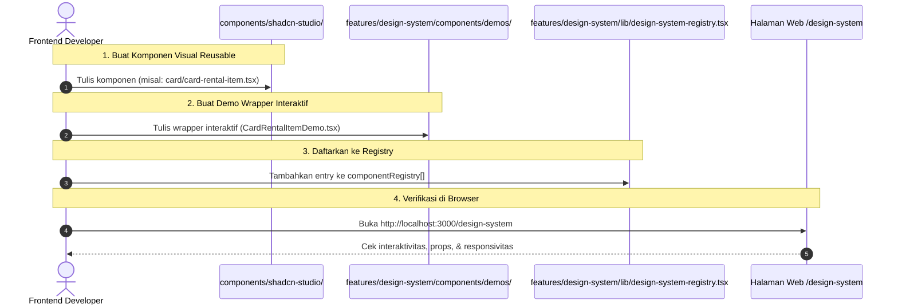

# 🎨 SOP-04: Standarisasi UI & Registry Design System
## Bicket Marketplace Engineering Office

---

| Dokumen Kontrol | Keterangan |
| :--- | :--- |
| **ID SOP** | `SOP-DEV-004` |
| **Versi** | `v1.0` |
| **Status** | **Approved & Active** |
| **Level Prioritas** | 🔴 **Must-Have (Wajib)** |
| **Otoritas / Pemilik** | Chief Technology Officer (CTO) |
| **Target Audience** | Frontend Developer, UI/UX Designer, QA Tester |
| **Tanggal Efektif** | 31 Agustus 2026 |

---

## 1. 🎯 Tujuan (Purpose)

1. **Anti-Duplikasi Antarmuka (*Zero UI Duplication*)**: Menghindari pembuatan ulang kode CSS/HTML untuk elemen visual yang telah tersedia di ekosistem Bicket.
2. **Konsistensi Visual & Estetika Premium**: Menjaga bahasa desain Bicket yang elegan (gabungan modern flat + *skeuomorphic micro-details* yang khas untuk industri persewaan baju/lifestyle).
3. **Katalog Desain Hidup (*Living Component Catalog*)**: Memelihara halaman `/design-system` sebagai wadah pengujian interaktif seluruh elemen UI reusable sebelum diaplikasikan pada fitur produksi.
4. **Efisiensi & Kecepatan Pengiriman Fitur**: Mempercepat pembuatan halaman baru (*rapid prototyping*) dengan merakit komponen-komponen siap pakai (*composable blocks*).

---

## 2. 🏛️ Hirarki 3-Tingkat Komponen UI Bicket

Setiap komponen UI di Bicket memiliki rumah dan tanggung jawab yang tegas:

```
┌─────────────────────────────────────────────────────────────────────────────┐
│ 1. ATOMIC BASE (@/components/ui/)                                           │
│    - Fondasi dasar Shadcn UI (Radix Primitives)                             │
│    - File: button.tsx, input.tsx, badge.tsx, dialog.tsx, dropdown-menu.tsx │
│    - Sifat: Netral, sangat kecil, tanpa konteks bisnis                      │
├─────────────────────────────────────────────────────────────────────────────┤
│ 2. REUSABLE STUDIO ELEMENTS (@/components/shadcn-studio/)                   │
│    - Elemen UI visual tingkat lanjut & skeuomorphic khas Bicket             │
│    - File: card-solution-skeuo.tsx, switch-skeuo.tsx, price-tag.tsx         │
│    - Sifat: Reusable antar-fitur, mandiri (*self-contained*), visual-rich   │
│    - WAJIB terdaftar di /design-system                                      │
├─────────────────────────────────────────────────────────────────────────────┤
│ 3. FEATURE COMPOSITE (features/[fitur]/components/)                        │
│    - Komponen spesifik alur bisnis (ProductFormCard, OrderSummaryTable)     │
│    - Section makro / layout halaman (HeroSection, Sidebar, Footer)          │
│    - WAJIB mengimpor Level 1 & Level 2 (Dilarang duplikasi CSS dari nol)   │
└─────────────────────────────────────────────────────────────────────────────┘
```

---

## 3. 📏 Aturan "Rule of Two" (Kapan Komponen Wajib Masuk Studio)

1. **Kriteria Masuk `components/shadcn-studio/`**:
   - Jika suatu elemen antarmuka (seperti *Card*, *Badge status*, *Button group*, *Drawer filter*, atau *Switch visual*) digunakan atau berpotensi digunakan pada **minimal 2 tempat/fitur yang berbeda**.
   - Komponen tersebut bersifat **elemen UI mikro / blok reusable**, bukan layout makro (seperti Full Sidebar, Full Navbar, atau Hero Section).
2. **Kewajiban Registrasi**:
   - Setiap elemen yang masuk ke `@/components/shadcn-studio/` **WAJIB** dibuatkan *Demo Showcase* dan didaftarkan ke `componentRegistry` di `/design-system`.

---

## 4. 🔄 Alur Kerja Pembuatan Komponen Reusable (4-Step Studio Flow)



---

### Contoh Implementasi Pendaftaran Registry:

#### Langkah 1: Buat Komponen di `components/shadcn-studio/`
```tsx
// components/shadcn-studio/card/card-rental-tag.tsx
import * as React from "react";
import { cn } from "@/lib/utils";

interface CardRentalTagProps {
  label: string;
  status: "READY" | "PREORDER";
  className?: string;
}

export function CardRentalTag({ label, status, className }: CardRentalTagProps) {
  return (
    <span
      className={cn(
        "inline-flex items-center px-3 py-1 rounded-full text-xs font-semibold shadow-xs transition-colors",
        status === "READY"
          ? "bg-emerald-500/10 text-emerald-600 border border-emerald-500/20"
          : "bg-amber-500/10 text-amber-600 border border-amber-500/20",
        className
      )}
    >
      {label}
    </span>
  );
}
```

#### Langkah 2: Buat Demo di `features/design-system/components/demos/`
```tsx
// features/design-system/components/demos/CardRentalTagDemo.tsx
"use client";

import { CardRentalTag } from "@/components/shadcn-studio/card/card-rental-tag";

export function CardRentalTagDemo() {
  return (
    <div className="flex gap-3 items-center p-4">
      <CardRentalTag label="Tersedia Sekarang" status="READY" />
      <CardRentalTag label="Pre-Order 3 Hari" status="PREORDER" />
    </div>
  );
}
```

#### Langkah 3: Daftarkan ke `design-system-registry.tsx`
```tsx
// features/design-system/lib/design-system-registry.tsx
import { CardRentalTagDemo } from "../components/demos/CardRentalTagDemo";

export const componentRegistry = [
  // ...komponen yang sudah ada...
  {
    id: "card-rental-tag",
    name: "Card Rental Tag",
    category: "Badge & Tags",
    description: "Indikator status ketersediaan sewa produk (Ready vs Pre-Order)",
    component: <CardRentalTagDemo />,
  },
];
```

---

## 5. 🎨 Standar Styling Tailwind CSS v4 (No Arbitrary Values)

Untuk memastikan konsistensi tema dan kemudahan *theme switching* (Dark/Light mode):

### 5.1 Larangan Nilai Sembarangan (*No Arbitrary Values*)
- ❌ **Dilarang**: `text-[#ff6b00]`, `bg-[#1e1e2f]`, `p-[17px]`, `rounded-[11px]`, `w-[325px]`.
- ✅ **Wajib**: Menggunakan token semantik Tailwind dan CSS Variables:
  - Warna: `text-primary`, `bg-card`, `bg-muted`, `text-muted-foreground`, `border-border`.
  - Spacing: `p-4`, `p-6`, `gap-3`, `gap-4`.
  - Radius: `rounded-lg`, `rounded-xl`, `rounded-2xl`, `rounded-full`.

---

### 5.2 Standar Micro-Interactions & Skeuomorphism Bicket
Untuk komponen bergaya skeuomorphic halus (misal kartu solusi, tombol sewa):
1. **Gunakan Layered Shadows**: Manfaatkan utilitas bayangan bertingkat (`shadow-xs`, `shadow-md`, atau `@utility shadow-skeuo-soft`).
2. **Transisi Halus**: Selalu sertakan `transition-all duration-200 ease-out active:scale-[0.98]` pada elemen yang dapat diklik.
3. **Border Ringan**: Gunakan `border border-border/40` atau `border-white/10` untuk memberi definisi batas elemen yang tajam.

---

## 6. 📱 Standar Responsivitas & Aksesibilitas (A11y)

Setiap elemen UI Reusable yang didaftarkan wajib memenuhi standar:
1. **Responsif Mobile-First**: Elemen tidak boleh *overflow* atau memotong layar pada lebar minimal **375px** (viewport iPhone/Android standar).
2. **Keyboard Operable**: Elemen interaktif (button, switch, modal) wajib dapat diakses dan dioperasikan menggunakan tombol `Tab` dan `Enter/Space` (didukung oleh Radix UI Primitives).
3. **Screen Reader Accessible**: Form input wajib memiliki label atau `aria-label` yang jelas.

---

## 7. ⛔ Larangan Keras (*Strict Prohibitions*)

1. ❌ **Dilarang menuliskan duplikasi CSS/HTML inline** di dalam `features/[fitur]/components/` jika komponen visualnya sudah tersedia di `components/shadcn-studio/` atau `components/ui/`.
2. ❌ **Dilarang memasukkan layout halaman makro** (seperti Full Hero, Full Sidebar, Full Footer) ke dalam `/design-system` registry (Hanya untuk UI Elements Reusable).
3. ❌ **Dilarang menggunakan warna Hex hardcoded (`#ffffff`, `#000000`, `#ff5500`)** di luar konfigurasi tema terpusat.
4. ❌ **Dilarang membuat komponen di `components/shadcn-studio/` tanpa mendaftarkannya ke `design-system-registry.tsx`**.

---

*Dokumen ini merupakan panduan baku tata kelola antarmuka pengguna dan konsistensi visual Bicket Marketplace.*
