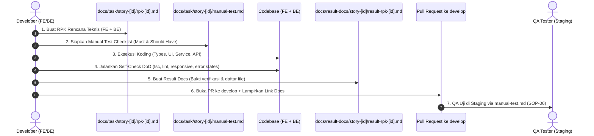

# 📋 SOP-05: Task Planning & Definition of Done (DoD)
## Bicket Marketplace Engineering Office

---

| Dokumen Kontrol | Keterangan |
| :--- | :--- |
| **ID SOP** | `SOP-DEV-005` |
| **Versi** | `v1.0` |
| **Status** | **Approved & Active** |
| **Level Prioritas** | 🔴 **Must-Have (Wajib)** |
| **Otoritas / Pemilik** | Chief Technology Officer (CTO) |
| **Target Audience** | Seluruh Developer (Frontend, Backend, Fullstack), Product Lead, QA |
| **Tanggal Efektif** | 31 Agustus 2026 |

---

## 1. 🎯 Tujuan (Purpose)

1. **Standardisasi Perencanaan Fitur**: Memastikan setiap pekerjaan memiliki dokumen rencana kerja (RPK: Rencana Pengembangan Kerja) yang terpadu sebelum developer menulis kode.
2. **Kriteria Selesai yang Jelas (*Zero Ambiguity Definition of Done*)**: Menghilangkan perdebatan status *"sudah selesai atau belum"* melalui checklist teknis dan fungsional yang objektif.
3. **Dokumentasi Hasil Terintegrasi (*Result Tracking*)**: Merekam jejak implementasi teknis ke dalam satu dokumen ringkasan hasil (*Result Docs*) per Story/Fitur agar transparan dan mudah diaudit.
4. **Efisiensi Monolith**: Menyatukan rencana dan laporan pengerjaan Frontend dan Backend dalam satu wadah tanpa birokrasi berlebih.

---

## 2. 📁 Struktur Dokumen Task & Result per Fitur

Setiap pengerjaan fitur pada folder `features/[fitur]/` wajib memiliki struktur folder dokumentasi standar:

```
features/[fitur]/
├── docs/
│   ├── task/
│   │   └── story-[id]/
│   │       ├── rpk-[id].md          <-- DOKUMEN RENCANA KERJA TERPADU (FE + BE)
│   │       └── manual-test.md       <-- DOKUMEN MANUAL TEST CHECKLIST (MUST & SHOULD HAVE)
│   └── result-docs/
│       └── story-[id]/
│           └── result-rpk-[id].md   <-- DOKUMEN LAPORAN HASIL KERJA TERPADU
├── components/                      # Komponen UI Fitur
├── hooks/                           # Custom Hooks & Data Fetching
├── services/                        # Service Prisma & Business Logic
├── types.ts                         # Zod Schema & TypeScript Types
└── api.ts                           # API Fetcher Client
```

---

## 3. 📝 Format Standar RPK (Rencana Pengembangan Kerja)

Sebelum memulai pengerjaan, developer wajib membuat file `features/[fitur]/docs/task/story-[id]/rpk-[id].md` menggunakan template baku:

```markdown
# 📋 RPK: [Story ID] - [Nama Fitur]
## Modul: [Nama Fitur / Domain]

---

### 1. 🎯 Objektif & User Story
- **Sebagai**: [Buyer / Creator / Admin]
- **Saya ingin**: [Aksi yang ingin dilakukan]
- **Sehingga**: [Manfaat / Value bisnis yang didapatkan]

---

### 2. 📐 Rencana Perubahan Teknis (Technical Plan)

#### A. Backend & Database (Data Layer)
- **Database Schema**: Perubahan `prisma/schema.prisma` (jika ada).
- **API Endpoint**: `METHOD /api/[fitur]/...` (Input schema & output response).
- **Business Logic**: Validasi saldo / status / otentikasi di `features/[fitur]/services/`.

#### B. Frontend & Antarmuka (Presentation Layer)
- **Komponen UI**: Komponen yang dibuat di `features/[fitur]/components/`.
- **Integrasi Studio**: Mengimpor komponen dari `@/components/shadcn-studio/` atau `@/components/ui/`.
- **Custom Hook**: Pembuatan hook di `features/[fitur]/hooks/use[Fitur].ts`.
- **State & Form**: React Hook Form + Zod resolver dari `features/[fitur]/types.ts`.

---

### 3. 🧪 Skenario Pengujian (Test Scenarios)
1. **Happy Flow**: Pengguna mengisi data valid dan operasi berhasil.
2. **Negative Flow**: Pengguna mengisi data tidak valid (Muncul pesan error validasi Zod).
3. **Edge Case**: Koneksi lambat (Loading skeleton muncul), Stok habis, Saldo tidak cukup.
```

---

## 4. ✅ Checklist Definition of Done (DoD)

Suatu Story / Task **HANYA BOLEH** ditandai sebagai **SELESAI (Done)** dan diajukan ke branch `develop` jika memenuhi **5 Kriteria Mutlak**:

| No | Kriteria DoD | Indikator Keberhasilan |
| :--- | :--- | :--- |
| **1** | 🛡️ **Type Safety & Lint Clean** | Lolos perintah `npx tsc --noEmit` dan `npm run lint` tanpa error ataupun warning kritis. Dilarang menggunakan type `any` atau `// @ts-ignore`. |
| **2** | 📱 **Responsif & Visual Aligned** | Tampilan teruji pada resolusi **Mobile (375px)** dan **Desktop (1440px)**. Menggunakan token resmi Tailwind v4 (No arbitrary hex colors). |
| **3** | 🔄 **Complete State Handling** | Memiliki penanganan lengkap untuk **3 State**: <br>1. *Loading State* (Skeleton / Spinner)<br>2. *Empty State* (Ilustrasi / pesan jika data kosong)<br>3. *Error State* (Toast / Banner notifikasi ramah pengguna). |
| **4** | 📄 **Dokumentasi Lengkap** | File `result-rpk-[id].md` (laporan hasil) dan `manual-test.md` (checklist uji QA Must & Should Have) telah dibuat di folder task/result. |
| **5** | 👥 **Code Review & QA Approved** | Pull Request ke `develop` disetujui reviewer, dan checklist `manual-test.md` diverifikasi lulus oleh QA di Staging (SOP-06). |

---

## 5. 📊 Format Standar Dokumen Hasil (`result-rpk-[id].md`)

Setelah pengerjaan selesai dan lolos verifikasi lokal, developer wajib membuat file `features/[fitur]/docs/result-docs/story-[id]/result-rpk-[id].md` menggunakan template berikut:

```markdown
# 🏆 Result Docs: [Story ID] - [Nama Fitur]
## Modul: [Nama Fitur / Domain]

---

| Kontrol Dokumen | Keterangan |
| :--- | :--- |
| **Tanggal Selesai** | [Tanggal] |
| **Developer** | [Nama Developer] |
| **Branch Git** | `feat/[Story ID]-[nama]` |
| **Status DoD** | ✅ **Passed All 5 Criteria** |

---

### 1. 📦 Ringkasan Hasil Pengerjaan
[Penjelasan singkat 1-2 paragraf mengenai apa yang telah berhasil dibangun dan bagaimana fitur bekerja].

---

### 2. 🗂️ Daftar File yang Dibuat / Dimodifikasi
- **Data & Backend Layer**:
  - `[NEW/MOD] app/api/[fitur]/route.ts`
  - `[NEW/MOD] features/[fitur]/services/[service].ts`
  - `[NEW/MOD] features/[fitur]/types.ts`
- **Presentation & Frontend Layer**:
  - `[NEW/MOD] features/[fitur]/components/[Component].tsx`
  - `[NEW/MOD] features/[fitur]/hooks/use[Fitur].ts`
  - `[NEW/MOD] app/(routes)/[halaman]/page.tsx`

---

### 3. 🧪 Bukti Verifikasi & Pengujian
- **Tampilan Antarmuka (UI)**: [Screenshot/GIF tampilan Mobile 375px & Desktop].
- **Respons API**: [Contoh respons JSON sukses dan error].
- **Hasil Typecheck**: `npx tsc --noEmit` -> *0 Errors*.

---

### 4. 💡 Catatan Teknis / Next Steps
[Catatan penting untuk tim selanjutnya, misal dependensi environment variable baru atau rencana optimasi di sprint berikutnya].
```

---

## 6. 🔄 Alur Siklus Hidup Tugas (Task Lifecycle Workflow)



---

## 7. ⛔ Larangan Keras (*Strict Prohibitions*)

1. ❌ **Dilarang memulai koding fitur besar tanpa dokumen RPK** di `features/[fitur]/docs/task/`.
2. ❌ **Dilarang membuka PR ke `develop` tanpa menyertakan dokumen `manual-test.md`** yang siap diuji oleh tim QA.
3. ❌ **Dilarang menyatakan fitur selesai jika belum memenuhi seluruh 5 poin DoD**.
4. ❌ **Dilarang memisahkan dokumen RPK/Result menjadi berkas FE dan BE yang terpecah** (Wajib disatukan dalam satu dokumen terpadu per story).

---

*Dokumen ini merupakan panduan baku tata kelola perencanaan dan penyelesaian tugas rekayasa perangkat lunak di Bicket Marketplace.*
