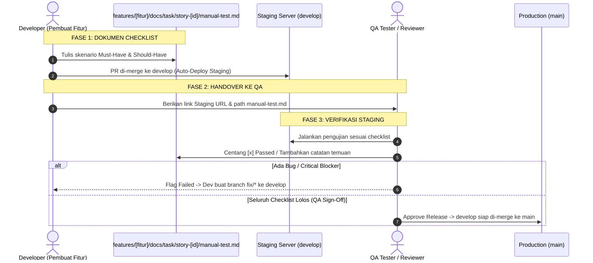

# 🧪 SOP-06: Pengujian Manual QA & Staging Verification
## Bicket Marketplace Engineering Office

---

| Dokumen Kontrol | Keterangan |
| :--- | :--- |
| **ID SOP** | `SOP-DEV-006` |
| **Versi** | `v1.0` |
| **Status** | **Approved & Active** |
| **Level Prioritas** | 🔴 **Must-Have (Wajib)** |
| **Otoritas / Pemilik** | Chief Technology Officer (CTO) |
| **Target Audience** | Seluruh Developer (Pembuat Fitur), QA Engineer / Tester |
| **Tanggal Efektif** | 31 Agustus 2026 |

---

## 1. 🎯 Tujuan (Purpose)

1. **Jembatan Handover Dev ke QA**: Memastikan tim QA memiliki panduan pengujian yang jelas, ringkas, dan terfokus pada skenario penting tanpa perlu menebak alur fitur baru.
2. **Pengujian Efisien & Tidak Bertele-tele**: Menstrukturkan skenario uji ke dalam **Must-Have (Fungsi Inti & Validasi Kritis)** dan **Should-Have (Responsif Mobile & State UX)** agar proses testing cepat dan agile.
3. **Quality Gate Sebelum Production**: Menjamin branch `develop` (Staging) hanya dapat di-merge ke `main` (Production) setelah seluruh checklist diverifikasi dan disetujui (*QA Sign-Off*).

---

## 2. 🔄 Alur Kerja Handover Dev ➔ QA ➔ Release



---

## 3. 📝 Format Standar Dokumen `manual-test.md` (Ringkas & Terarah)

Developer wajib membuat file di path:
`features/[fitur]/docs/task/story-[id]/manual-test.md`

### Template Baku:

```markdown
# 🧪 Manual Test Checklist: [Story ID] - [Nama Fitur]
## Modul: [Nama Fitur] | Target: Staging Environment

---

| Informasi Pengujian | Keterangan |
| :--- | :--- |
| **Developer** | [Nama Developer Pembuat Fitur] |
| **QA Tester** | [Nama QA yang Menguji] |
| **URL Staging** | `https://staging.bicket.id/...` |
| **Tanggal Uji** | [Tanggal] |
| **Status Akhir** | [ ] **PASSED (Siap Rilis)** / [ ] **FAILED (Perlu Fix)** |

---

### 🔑 1. Kebutuhan Pengujian (Pre-Conditions)
- **Akun Uji**: Role `[Buyer / Creator / Admin]` — Email: `user.test@bicket.id`
- **Data Prasyarat**: [Misal: Memiliki 1 produk aktif dengan stok 2]

---

### 🔴 2. MUST-HAVE TEST CASES (Fungsi Inti & Keamanan)
*Fokus: Alur utama pengguna (Happy Path) & pencegahan data rusak (Critical Validation).*

- [ ] **TC-M01: [Happy Path] Eksekusi Alur Utama Fitur**
  - *Langkah*: Buka halaman fitur ➔ Isi data lengkap & valid ➔ Klik tombol submit.
  - *Expected*: Operasi sukses, muncul notifikasi toast berhasil, data tersimpan di database.
  - *Hasil QA*: `[ PASSED / FAILED ]` — Catatan: -

- [ ] **TC-M02: [Validasi Kritis] Penolakan Input Tidak Valid**
  - *Langkah*: Kosongkan kolom wajib / masukkan nominal tidak valid ➔ Klik submit.
  - *Expected*: Tombol submit dicegah atau muncul pesan error validasi Zod yang jelas.
  - *Hasil QA*: `[ PASSED / FAILED ]` — Catatan: -

- [ ] **TC-M03: [Hak Akses / Otorisasi] Proteksi Role**
  - *Langkah*: Coba akses endpoint/halaman menggunakan role yang tidak berhak (misal: Buyer akses dashboard Creator).
  - *Expected*: Di-redirect ke login / muncul pesan `403 Forbidden`.
  - *Hasil QA*: `[ PASSED / FAILED ]` — Catatan: -

---

### 🟡 3. SHOULD-HAVE TEST CASES (Responsif & UX Handling)
*Fokus: Kenyamanan pengguna mobile, loading, dan pesan kosong.*

- [ ] **TC-S01: [Tampilan Mobile] Responsivitas Layar HP (375px)**
  - *Langkah*: Buka tampilan di Google Chrome Device Mode (375px lebar layar).
  - *Expected*: Tidak ada elemen tombol terpotong, teks bertumpuk, atau horizontal scrolling yang rusak.
  - *Hasil QA*: `[ PASSED / FAILED ]` — Catatan: -

- [ ] **TC-S02: [State UX] Loading Skeleton & Empty State**
  - *Langkah*: Buka halaman saat data kosong / jaringan lambat.
  - *Expected*: Muncul skeleton animasi saat loading, dan pesan ilustrasi ramah saat data kosong.
  - *Hasil QA*: `[ PASSED / FAILED ]` — Catatan: -

---

### ✍️ 4. Verifikasi & Sign-Off QA
- **Catatan / Temuan QA**: [Tuliskan jika ada kendala minor atau saran optimasi]
- **Approval Sign-Off**: `[ APPROVED / REJECTED ] oleh [Nama QA] pada [Tanggal/Jam]`
```

---

## 4. 🚦 Aturan Sign-Off Sebelum Merge ke `main`

1. **Seluruh Item MUST-HAVE Wajib 100% Passed**:
   - Jika ada 1 saja item Must-Have yang berstatus `FAILED`, rilis ke `main` **DILARANG KERAS**.
2. **Item SHOULD-HAVE dengan Toleransi Bug Minor**:
   - Jika ada kendala minor pada Should-Have (misal padding kurang rapi 2px), QA dapat memberikan *Conditional Approval* dengan syarat developer langsung membuat task `fix/*` di sprint berikutnya.
3. **Penyelesaian Bug (Bug Lifecycle)**:
   - Bug yang ditemukan di Staging diperbaiki melalui branch `fix/[ID]-nama-bug` ➔ Merge ke `develop` ➔ QA re-test item yang gagal.

---

## 5. ⛔ Larangan Keras (*Strict Prohibitions*)

1. ❌ **Dilarang me-merge `develop` ke `main` tanpa checklist `manual-test.md` yang telah berstatus `PASSED`**.
2. ❌ **Dilarang bagi Developer menguji dan menandatangani (*Sign-Off*) dokumennya sendiri** (Wajib diuji oleh orang kedua: QA, Peer Dev, atau Product Lead).
3. ❌ **Dilarang membuat dokumen test checklist yang berbelit-belit** (Cukup fokus pada Must-Have & Should-Have).

---

*Dokumen ini merupakan panduan resmi pengujian kualitas dan verifikasi staging Bicket Marketplace.*
